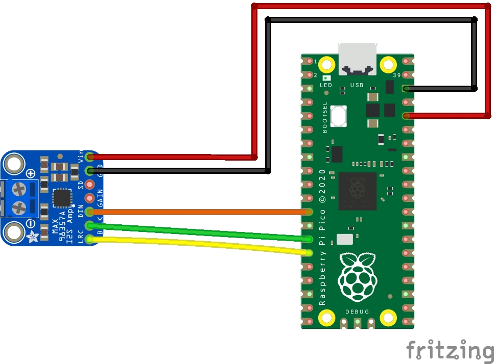

## Raspberry Pi Pico - WAV sound file player

Using CircuitPython on a Raspberry Pi Pico we can play short clips of sounds.To acquire good quality sound we will use I2S audio (DAC). The Raspberry Pico does not have I2S hardware. The team at Adafruit industries has created the necessary modules to achieve I2S audio in CircuitPython. 

### Hardware
- Raspberry Pi Pico
- MAX98357A I2S amplifier
- Speaker

### Software:
- CircuitPython 7.+ Download the latest firmware at the [official site](https://circuitpython.org/board/raspberry_pi_pico/)

### Sound file preparation

- The Raspberry Pico has 2MB of on-board Flash memory. Sound files must be under 2MB
- CircuitPython supports mono or stereo, at 22 KHz sample rate (or less) and 16-bit WAV format 
- I used sox and ffmpeg to prepare my sound file

```bash
sudo apt-get install mediainfo ffmpeg sox

#verify sound file wih mediainfo
mediainfo file.wav

#example of augmenting volume by 10dB with ffmpeg
ffmpeg -i input.wav -filter:a "volume=10dB" output.wav

#change file to 16 bits with sox
sox file.wav -b 16 output.wav
```


### Hookup guide:

__ALWAYS ADD A RESISTOR FOR THE LED!__ (220 or 330 ohm for example)



### References:
- [In-depth tutorial](https://www.recantha.co.uk/blog/?p=20950)
- [CircuitPython Audio file preparations](https://learn.adafruit.com/circuitpython-essentials/circuitpython-audio-out#play-a-wave-file)
- [CircuitPython Audiocore Wiki](https://circuitpython.readthedocs.io/en/latest/shared-bindings/audiocore/index.html#audiocore.WaveFile)
- [ffmpeg audio volume manipulation](https://trac.ffmpeg.org/wiki/AudioVolume)
- [sox audio conversions](https://www.nesono.com/node/275)
